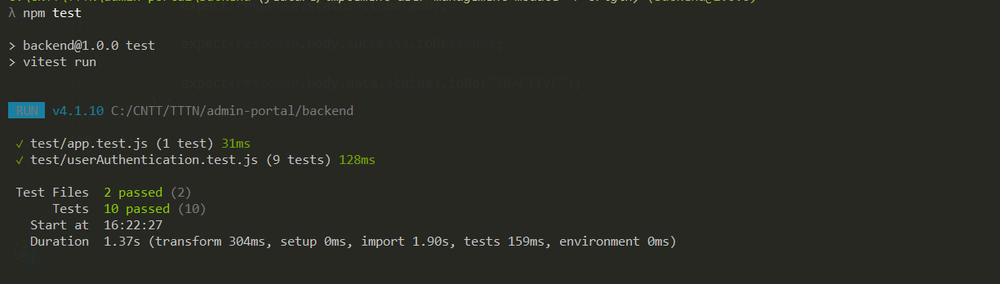

# User Management

Module quản lý User dành cho Admin Portal.

## Features

- User List: Search, Filter, Pagination
- User Detail
- Update User Status
- Authentication & Authorization
- Validation & Business Rules
- Error Handling
- Automated Tests

## API

Base URL: `/api/admin`

 GET    `/users`               | Get user list |
 GET    `/users/:id`           | Get user detail |
 PATCH  `/users/:id/status`    | Update user status |

Status:

`ACTIVE` · `INACTIVE` · `LOCKED`

## Authentication

User Management yêu cầu `ADMIN`.

Development authentication:

```env
//port backend
PORT=

//database
DB_HOST=
DB_PORT=
DB_NAME=
DB_USER=
DB_PASSWORD=

DEV_AUTH_TOKEN=your-abc123
DEV_CURRENT_USER_ID=1
DEV_CURRENT_USER_ROLE=ADMIN

## Automated Testing
should return 401 when token is missing.
should return 401 when token is invalid.
should return 403 when user role is USER.
should allow ADMIN to access user list.
should prevent ADMIN from locking their own account.
should return 404 when user does not exist.
should return 400 when status is invalid.
should return 500 when database error occurs.
should allow ADMIN to update user status successfully.

All Pass
hình ảnh test thành công

